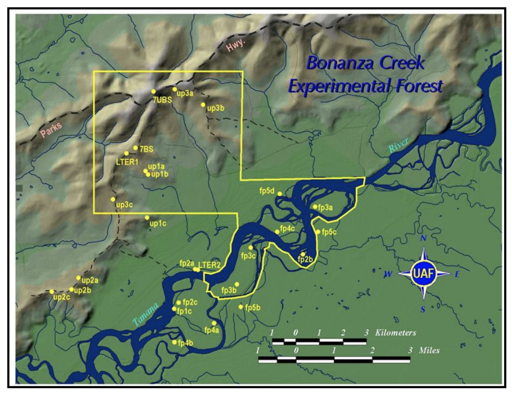
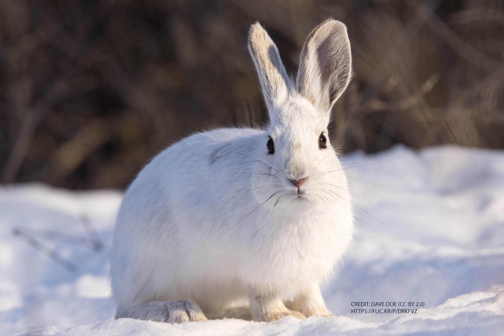

<style type="text/css">

body{ /* Normal  */
      font-size: 14px;
  }
td {  /* Table  */
  font-size: 8px;
}
h1.title {
  font-size: 30px;
  color: DarkGreen;
  text-align:center;
}
h1 { /* Header 1 */
  font-size: 28px;
  color: DarkGreen;
}
h2 { /* Header 2 */
    font-size: 22px;
  color: DarkGreen;
}
h3 { /* Header 3 */
  font-size: 18px;
  font-family: "Times New Roman", Times, serif;
  color: DarkGreen;
}
code.r{ /* Code block */
    font-size: 12px;
}
pre { /* Code block - determines code spacing between lines */
    font-size: 14px;
}
</style>

```{r setup, include=FALSE}
knitr::opts_chunk$set(echo = TRUE)
```


<br>


<div style="width:700px; margin: 0 auto; text-align:center">
Prepared by Tara Jagadeesh  
Image by Bonanza Creek LTER  
February 2020  
</div>

***

### Project Summary
This project examines characteristics of snowshoe hares in the Bonanza Creek Experimental Forest (BCEF). First, we consider the gender distribution of population over time by finding the proportion of females caught in traps. We then examine how average weight differs between female and male hares at three different study sites (bonbs, bonmat, bonrip). Data used in this projected was collected from 1999 to 2012 by Kielland et al. (2017) using the capture recapture method.


### Study Area and Species of Interest
<br>
<div style="width:700px; margin: 0 auto; text-align:center">
{width=40%} &emsp;&emsp;&emsp; &emsp;&emsp;
{ width=44% }  </div>
&emsp;&emsp;&emsp;&emsp;&emsp;&emsp;&emsp;&emsp;&emsp;Figure 1: Map of Bonanza Creek Experimental Forest &emsp;&emsp;&emsp;&emsp;&emsp;&emsp;&emsp;&emsp;&emsp;Figure 2: Snowshoe Hare 

<br>


### Data Analysis
```{r, message=FALSE, warning=FALSE}
#Load packages
library(tidyverse)
library(janitor)
library(lubridate)
library(kableExtra)

#Read in snowshoe hare data
hares <- read_csv("showshoe_lter.csv")
```

```{r, message=FALSE, }
#Clean up data
hares_clean <- hares %>% 
  #Convert all entries to lowercase
  mutate(site = str_to_lower(grid), trap = str_to_lower(trap), sex = str_to_lower(sex), 
         age = str_to_lower(age), animal_id = b_key, study = str_to_lower(study)) %>% 
  #Add a column for year of observation only
  mutate(date = mdy(date), year = year(date)) %>% 
  select(date, year, site, trap, animal_id, sex, age, weight, hindft, session_id, 
         study, notes) #Keep columns of interest

#Create a simple dataframe with variables of interest
hares_weight <- hares_clean %>% 
  select(year, site, sex, weight, age) %>% 
  drop_na() %>% 
  #Include only rows which contain "m" or "f" in the sex column
  filter(sex %in% c("m", "f")) %>% 
  filter(age == "a") #Include only identified adult hares
```

```{r, message=FALSE}
#Calculate the proportion of female snowshoe hares trapped each year
sex_summary <- hares_weight %>% 
  group_by(year, sex) %>%  
  #Count the number of males and females trapped each year
  tally() %>%  
  #Sum males and females to find the total number of trappings each year
  mutate(sum = sum(n)) %>% 
  #Create a new column with the proportion of females
  mutate(ratio = n/sum) %>% 
  #Filter for females only and remove columns with insufficient data
  filter(year != 2002, year != 2003, sex == "f") 

#Make a graph comparing the proportion of female snowshoe hares trapped each year
sex_graph <- ggplot(data = sex_summary, aes(x= year, y = ratio)) +
  geom_col(fill = "darkslateblue") +
  scale_y_continuous(expand = c(0,0), limits = c(0, 1.1)) +
  scale_x_continuous(expand = c(0,0), breaks=seq(1999, 2012))+
  labs(x = "\n Year", y = "Proportion of females \n") +
  geom_text(aes(label = paste("n =",sum)), vjust=-0.5, size = 2.5) +
  theme_classic() 
sex_graph

```


**Figure 1. Proportion of female snowshoe hares captured in traps annually (1999 2012).** Due to insufficient data 2002, 2003, 2004 and were omitted. Sample size is given by n. Proportion of females varies by year, with most years exceeding 50% female. Data source: Kielland et al. (2017)

<br>

```{r, message=FALSE}
#Calculate summary statistics for weight 
hares_summary <- hares_weight %>% 
  group_by(site, sex) %>%  
  summarize( 
    n = length(weight),
    weight_avg = mean(weight),
    weight_sd = sd(weight),
    weight_min = min(weight),
    weight_max = max(weight)) %>% 
  mutate(sex = str_to_upper(sex)) %>% 
  select(sex, n, weight_avg, weight_sd, weight_min, weight_max)

#Remove the "site" column for easier table grouping
hares_summary2 <- hares_summary %>% 
  ungroup() %>% 
 select(-site)
```


```{r, message=FALSE}
#Create a table of the summary statistics 
table <- kable(hares_summary2, booktabs = T, col.names = c("Sex", "N", "Mean", "S.D.", "Min", "Max"), digits = 0, 
      caption = "Table 1: Summary statistics for snowshoe hare weight by sex at three
      different trapping sites (bonbs, bonmst, bonrip). Each site is located within the boundaries of the Bonanza Creek Experimental Forest. Data is averaged from 1999 to 2012, and units for weight are in grams.\n") %>% 
  kable_styling(bootstrap_options = c("striped"), full_width = T) %>% 
  pack_rows("Bonbs (n = 68)", 1, 2) %>% #Add group headings that correspond to site
  pack_rows("Bonmat (n = 120)", 3, 4) %>%
  pack_rows("Bonrip (n = 494)", 5, 6)

table 
```
<br>

