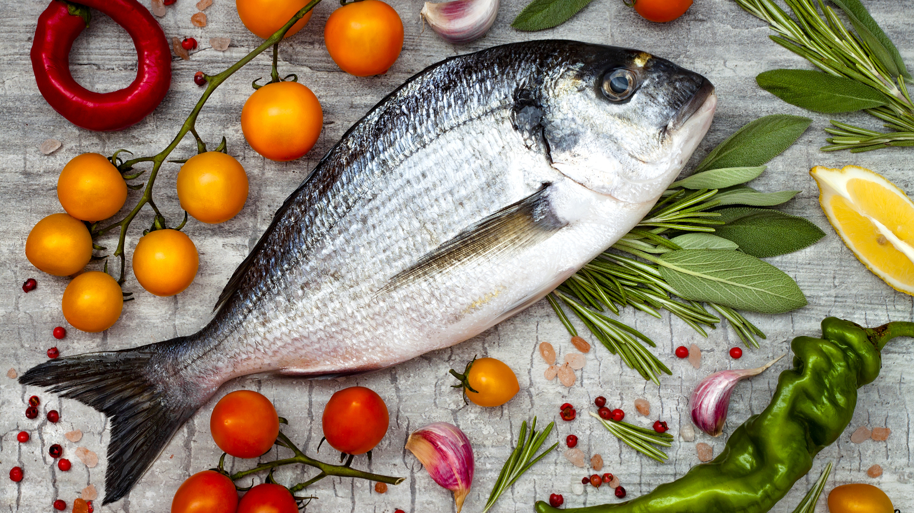

<style type="text/css">

body{ /* Normal  */
      font-size: 14px;
  }
td {  /* Table  */
  font-size: 8px;
}
h1.title {
  font-size: 30px;
  color: Black;
  text-align:center;
}
h1 { /* Header 1 */
  font-size: 28px;
  color: DarkGreen;
}
h2 { /* Header 2 */
    font-size: 22px;
  color: DarkGreen;
}
h3 { /* Header 3 */
  font-size: 18px;
  font-family: "Times New Roman", Times, serif;
  color: DarkGreen;
}
code.r{ /* Code block */
    font-size: 12px;
}
pre { /* Code block - determines code spacing between lines */
    font-size: 14px;
}
</style>


```{r setup, include=FALSE}
knitr::opts_chunk$set(echo = TRUE, 
                      message = FALSE, 
                      warning = FALSE)

library(tidyverse)
library(data.table)
library(janitor)
library(ggfortify)
```

<br>



<br>
<div style="width:700px; margin: 0 auto; text-align:center">
Prepared by Tara Jagadeesh  
Image by Bonanza Creek LTER  
February 2020  
</div>

***


### Project Summary
This project uses Principle Components Analysis (PCA) to examine the correlation between different food nutrients in fish. These nutrients include: Energy content, protein, fat, iron, zinc, magnesium, manganese, phosphorus, Vitamin B6, Vitamin B12, and Vitamin A. Fish analyzed span across several different species, and vary additionally by consumption type (raw, cooked, or canned). Data used for this project was originally collected by the USDA National Nutrient Database (2019). 

### Data Analysis
```{r, message=FALSE, warning=FALSE}
#Load packages
library(tidyverse)
library(data.table)

#Load USDA food nutrient data
food <- read_csv("usda_nutrients.csv") %>% #Load data 
  clean_names() #Convert column names to snake case

#Create a dataset for fish broken down by species and consumption type
fish <- food %>% 
  #Select variables of interest
  select(food_group, descrip, energy_kcal, protein_g, fat_g, iron_mg, zinc_mg, 
         magnesium_mg, manganese_mg, phosphorus_mg, vit_b6_mg, vit_b12_mcg, vit_a_mcg) %>% 
  #Find "raw" "cooked" and "canned" in the descrip and make a new column
  mutate(cook_type = case_when(  
    str_detect(descrip, "raw") ~ "Raw", 
    str_detect(descrip, "cooked") ~ "Cooked",
    str_detect(descrip, "canned") ~ "Canned")) %>% 
  #Break the descrip into group and species
  separate(descrip, into = c("group","species"), sep = ",") %>% 
  filter(group == "Fish") %>%  #Filter for only fish
  drop_na() %>% #Remove NAs
  mutate(food_group = str_to_lower(food_group), group = str_to_lower(group), 
         species = str_to_lower(species)) #Make column entries lowercase

#Create a dataset for variables of interest only
fish_variables <- fish %>% 
  select(Energy = energy_kcal, Protein = protein_g, Fat = fat_g, Iron = iron_mg, 
         Zinc = zinc_mg, Magnesium = magnesium_mg, Manganese = manganese_mg, Phosphorus =
           phosphorus_mg, "Vitamin B6" = vit_b6_mg, "Vitamin B12" = vit_b12_mcg, 
         "Vitamin A" = vit_a_mcg)
```

```{r, message=FALSE, warning=FALSE}
#Run PCA on fish dataset
fish_PCA <- prcomp(fish_variables, scale = TRUE) 

#Create PCA biplot 
fish_plot <- autoplot(fish_PCA, data = fish, colour = "cook_type",
         loadings.label = TRUE, loadings.label.size = 3, loadings.label.vjust = -0.5,
         loadings.label.colour = "black", loadings.label.repel = TRUE,
         loadings.colour = "black") + theme_bw() +
  scale_y_continuous(expand = c(0,0), limits = c(-0.2,0.3)) +
  scale_x_continuous(expand = c(0,0), limits = c(-0.2,0.3)) +
  labs(colour = "Consumption type")
fish_plot + scale_color_brewer(palette = "Paired") #Change color of legend items

```

**Figure 1. PCA biplot of food nutrients in fish.** Vectors are associated with specific food nutrient variables, while points represent individual observations categorized by consumption type. Principle components 1 and 2 account for 44.66% of the variance. Data source: USDA 

<br>

### Findings
Correlation:  
-Zinc and iron are positively correlated   
-Protein and phosporus are highly positively correlated  
-Vitamin A and Vitamin B12 are highly positively correlated  
-Magnesium and energy are highly positively correlated  
-Manganese and Vitamin B6 are negatively correlated  

Variance:  
-Of the 11 nutrient variables, manganese, zinc, iron, energy, fat, and vitamin B6 contribute the most to the variance of principle components 1 and 2. 

Groups/Clustering:  
-Clustering by consumption type is not immediately evident; further analysis is required. 

